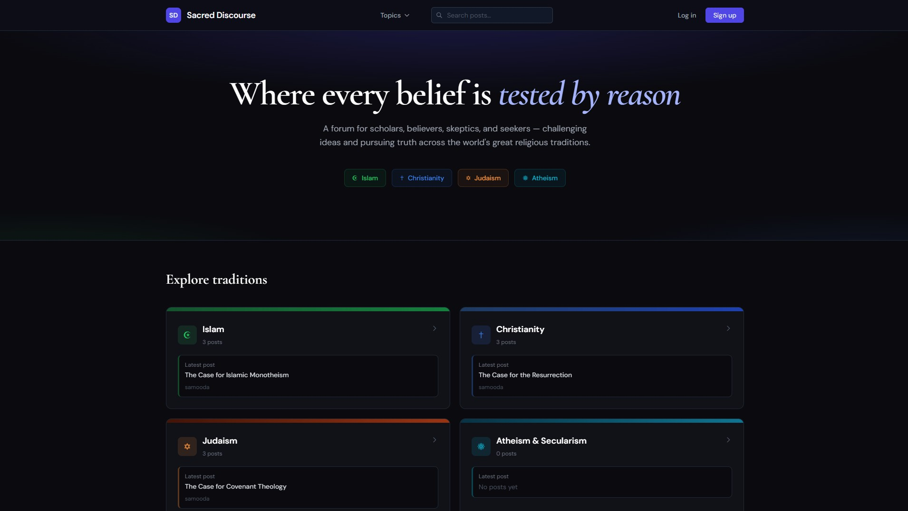
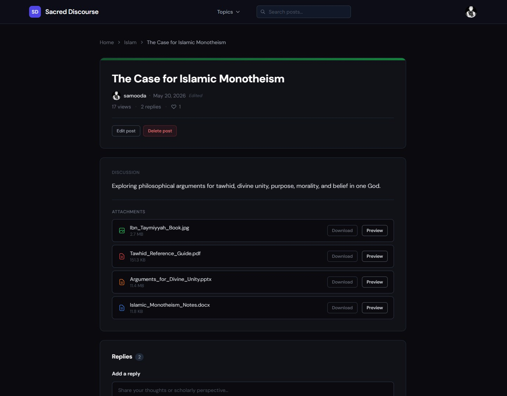
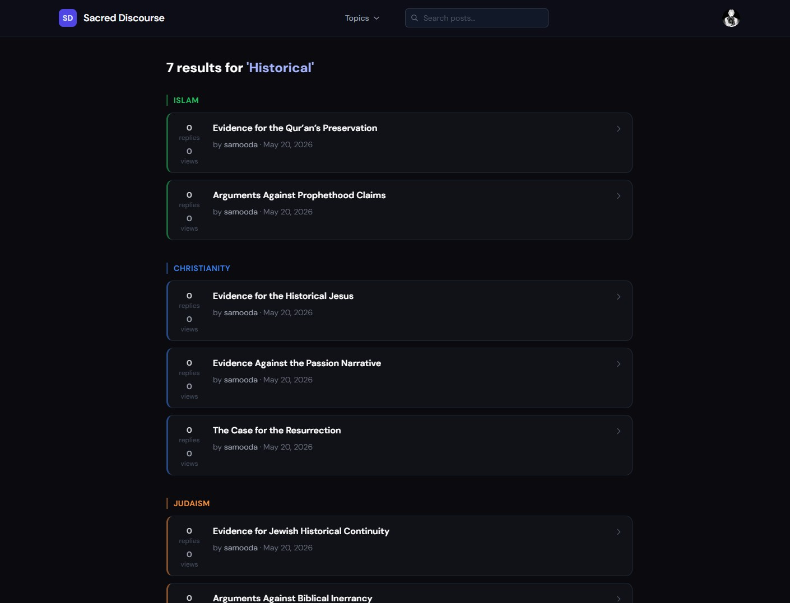

# Sacred Discourse

### A debate forum for religion, philosophy, and secular thought — built with real architecture decisions.

[](https://sacred-discourse.vercel.app)
[](https://react.dev)
[](https://supabase.com)
[](https://vercel.com)

---



---

## About

Sacred Discourse is a structured debate forum where students, believers, skeptics, and curious readers engage across four traditions — Islam, Christianity, Judaism, and Atheism & Secularism. It is a full-stack portfolio project built to demonstrate production-minded frontend architecture, thoughtful UX decisions, and a backend secured entirely through database-level policies.

The project spans the full lifecycle: schema design, Row Level Security, file upload pipelines, full-text search, optimistic UI, and a multi-phase UI polish process documented in a private planning file.

Every choice in this codebase was made deliberately. The sections below explain the most important ones.

---

## Live Demo

**[sacred-discourse.vercel.app](https://sacred-discourse.vercel.app)**

Create an account, post a discussion, reply to others, upload attachments, search across traditions, and edit your profile — the full flow is wired and live.

---

## Current Status

The app is fully deployed on Vercel. The following are all working end-to-end:

- Supabase Auth (email/password sign-up, sign-in, password reset)
- Database (posts, replies, likes, profiles, file attachments)
- Storage (post attachments and profile avatars)
- Full-text search via `tsvector` GIN index
- All CRUD operations with Row Level Security enforced

The live URL is the Vercel deployment URL (`sacred-discourse.vercel.app`). A custom domain may be added later if the project moves into longer-term use.

---

## Features

### Authentication
- Email/password sign-up and sign-in via Supabase Auth
- Email confirmation flow with a custom confirmation screen
- Forgot password → reset password via tokenised email link, handled automatically by Supabase's `onAuthStateChange`
- Password visibility toggle on all password fields
- Session persisted across tabs and page refreshes; navbar avatar syncs immediately on sign-in

### Posts & Discussions
- Create, edit, and delete posts with title (100 char), description (750 char), and optional file attachments
- Character counters on all fields that turn red near the limit
- Inline edit form with attachment management — add new files, remove existing ones, diff-based Storage cleanup on save
- Orphan-safe upload pipeline: if a post insert fails after files are uploaded, Storage files are deleted automatically
- View counter incremented only by authenticated non-authors, updating local state immediately after the write so the displayed count is accurate without a re-fetch

### Replies
- Threaded replies per post with a 2,000-character limit
- Collapsible replies beyond 300 characters with a clean "Show more / Show less" toggle
- Reply form at the top of the section; smooth scroll to the bottom of the list on submit
- Post authors can delete any reply on their post; reply authors can delete their own

### Likes
- Optimistic like/unlike for both posts and replies — state updates instantly, reverts silently on network failure
- Like counts are public; the toggle is gated to authenticated users

### File Attachments
- Supported types: PDF, JPEG, PNG, GIF, PPTX, DOCX — validated client-side before upload
- 50 MB per-file size limit with per-file error messages
- Inline preview: PDFs in an `<iframe>`, images in a fullscreen modal, Office documents via the Office Online viewer
- Download links for all attachment types

### Search
- Full-text search across all posts using PostgreSQL `tsvector` with a GIN index
- `search_vector` is a generated column: `to_tsvector('english', title || ' ' || description)` — automatically kept in sync by the database
- Results grouped by tradition with per-topic accent colours
- Correct empty state distinguishes "no results" from a query failure

### Profiles
- Clickable author names throughout the app navigate to public profile pages
- Avatar upload to Supabase Storage with live preview, old avatar cleanup on update, and immediate navbar sync via `refreshProfile()`
- Display name editing inline; post history grouped by topic

### Navigation & Search
- Sticky navbar with a Topics dropdown that highlights the active tradition
- Keyboard-accessible search bar (Enter with ≥ 3 characters navigates to results, clears input)
- Route fade transition (160ms) and staggered post card enter animations (40ms delay per card, capped at 7)

---

## Tech Stack

| Technology | Role | Why |
|---|---|---|
| **React 18** | UI | Component model maps cleanly to the forum's entity hierarchy (Topic → Post → Reply). `useContext` for scoped state sharing without Redux overhead. |
| **Vite** | Build tool | Sub-second HMR during development. Trivial Vercel deployment. No configuration overhead compared to CRA. |
| **Tailwind CSS v3** | Styling | Utility-first keeps component styles co-located and eliminates CSS file sprawl. JIT mode handles arbitrary values (`border-[#2d3748]`) without a config change. |
| **React Router v6** | Routing | Nested route params (`/topic/:topicSlug/post/:postId`) map directly to the data hierarchy. `useSearchParams` handles the search flow cleanly. |
| **Supabase** | Auth, Database, Storage | Replaces a Node/Express backend entirely. Postgres RLS enforces data ownership at the database layer — not the application layer — so no route guard can accidentally expose data. |
| **Vercel** | Deployment | Zero-config for Vite projects. Preview deployments per branch. |

---

## Architecture & Design Decisions

### Row Level Security — trust the database, not the application

Every table has RLS enabled. Policies are strict and explicit: `author_id = auth.uid()` for writes, public read for posts, replies, likes, and profiles. The application never has to trust that a route guard ran correctly — the database rejects the operation outright if the policy fails.

This also means that if a new client is added (mobile app, CLI tool), it inherits the same security model without any extra work.

### `PostDetailContext` — scoped state without prop drilling

`PostDetailPage` manages 35+ state variables across four data-fetching effects, six event handlers, and four sub-components (`EditPostForm`, `AttachmentViewer`, `ReplyCard`, `FullscreenImageModal`). Passing all of this as props would make each component signature unreadable and tightly couple them to the parent's implementation.

The solution: a `PostDetailContext` created and provided inside `PostDetailPage`, consumed via a `usePostDetail()` hook. The context is not exported or accessible outside this module's graph — it is a private implementation detail, not a global concern. Sub-components are co-located in `src/components/post-detail/` and cannot be imported anywhere else.

### Full-text search with `tsvector` and GIN index

Search runs against a generated column rather than a `LIKE` query:

```sql
ALTER TABLE posts
  ADD COLUMN search_vector tsvector
  GENERATED ALWAYS AS (
    to_tsvector('english', coalesce(title, '') || ' ' || coalesce(description, ''))
  ) STORED;

CREATE INDEX posts_search_vector_idx ON posts USING GIN (search_vector);
```

The GIN index makes searches fast at scale. The `'english'` configuration applies stemming — a search for "believing" matches posts containing "belief". The column is maintained automatically by Postgres; there is no sync job or trigger to maintain.

### Optimistic updates — instant feedback, silent rollback

Like toggles for both posts and replies apply the state change before the Supabase call returns. If the call fails, the previous state is restored silently. This makes the UI feel instant on any network condition without sacrificing correctness.

```js
// Apply immediately
setPostLikedByUser(!wasLiked)
setPostLikeCount((c) => wasLiked ? c - 1 : c + 1)

// Revert on failure
if (error) {
  setPostLikedByUser(wasLiked)
  setPostLikeCount((c) => wasLiked ? c + 1 : c - 1)
}
```

### Shared utilities — one place to change, one place to test

Four utility modules (`format.js`, `fileValidation.js`, `fileIcons.js`) extracted from page components where logic was duplicated. `validateFiles` returns `{ valid, errors }` — it is a pure function with no side effects, making it trivially testable. Callers handle state updates independently.

### Single-query homepage

The homepage derives both post counts and the latest post preview per topic from a single Supabase query ordered by `created_at desc`. Client-side grouping runs in O(n) — one pass through the results. No N+1 queries, no loading states per card.

### View count integrity

Views increment only when `user !== null && user.id !== post.author_id`. The increment is fire-and-forget (a failed write is swallowed), but on success the local `post.views` state is updated immediately so the displayed count reflects reality without a re-fetch.

### File upload safety

The upload pipeline is sequenced deliberately:
1. Upload files to Storage
2. Insert the post row (with `.select('id').single()`)
3. Insert `file_attachments` rows

If step 2 fails after step 1 succeeds, the orphaned Storage files are deleted before the error is surfaced to the user. If step 3 fails, the post exists but has no attachments — a recoverable state the user can fix by editing the post.

---

## Screenshots

### Topic Page — Islam

*Post list with reply and view counts, topic-coloured left accent borders, and the inline new post form.*

### Post Detail — Attachments

*Post header with author avatar, engagement stats, and the attachment viewer with inline PDF preview.*

### Post Detail — Replies

*Reply thread with profile pictures, like buttons, collapsible long replies, and the reply form.*

### User Profile

*Profile page with avatar, post history grouped by tradition, and the inline edit form.*

### Search Results

*Full-text search results grouped by topic with tradition-coloured section headers.*

---

## Getting Started

### Prerequisites
- Node.js 18+
- A [Supabase](https://supabase.com) project

### Installation

```bash
git clone https://github.com/samooda/sacred-discourse.git
cd sacred-discourse
npm install
```

### Environment Variables

Create a `.env` file in the project root:

```env
VITE_SUPABASE_URL=your_supabase_project_url
VITE_SUPABASE_ANON_KEY=your_supabase_anon_key
```

Both values are available in your Supabase project under **Settings → API**.

### Run Locally

```bash
npm run dev
```

The app will be available at `http://localhost:5173`.

---

## Database Setup

The app uses five tables in Supabase: `profiles`, `posts`, `replies`, `likes`, and `file_attachments`. This README describes the required setup; a complete one-command schema file is not yet included in the repository.

**Key setup steps:**

1. Enable RLS on all tables and create the policies described in the architecture section
2. Add the `search_vector` generated column and GIN index to the `posts` table (SQL above)
3. Create two Storage buckets: `post-attachments` (public) and `avatars` (public, 5 MB limit)
4. Grant schema usage to `anon` and `authenticated` roles — Supabase requires this in addition to RLS policies:

```sql
grant usage on schema public to anon, authenticated;
grant select on all tables in schema public to anon;
grant all on all tables in schema public to authenticated;
```

A `profiles` row is created automatically via a Supabase trigger on `auth.users` insert, seeded with the `display_name` from signup metadata.

---

## Future Improvements

- **Semantic search** — replace or augment `tsvector` with embedding-based similarity search via a FastAPI microservice and `pgvector`, enabling conceptually related results across traditions
- **Real-time replies** — Supabase Realtime subscriptions to push new replies to all viewers of a post without polling
- **Mobile-responsive design** — the current layout is desktop-first; a responsive pass would bring the forum to smaller screens
- **Google OAuth** — a one-click sign-in path alongside the existing email/password flow
- **Moderation tools** — admin role with the ability to pin posts, lock threads, and remove content across all traditions
- **Pagination or infinite scroll** — the current implementation loads all posts per topic in a single query; pagination would be necessary at scale

---

## Author

**Abdessamad Atifi**

[github.com/samooda](https://github.com/samooda)

---

*Built as a portfolio project to demonstrate full-stack React development, Supabase-backed architecture, deliberate technical decisions, and end-to-end feature implementation.*
